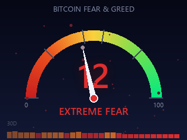
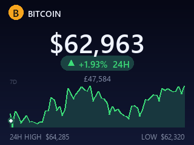
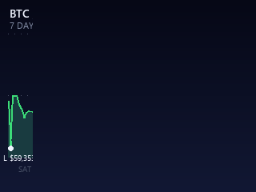

# Fear & Greed Index Display

[](https://opensource.org/licenses/MIT)
[](https://www.python.org/downloads/)
[](https://www.raspberrypi.org/)
[](https://alternative.me/crypto/fear-and-greed-index/)

A vivid, animated Bitcoin desk display for the Raspberry Pi Zero 2 W with a
Pimoroni Display HAT Mini (320x240 ST7789 LCD).

Version 3 replaces the old pre-rendered GIF playback with procedural
real-time rendering at ~30 FPS. Every screen is drawn live with Pillow,
so animations are smooth, data is always current, and no GIF assets are
needed.

| Fear & Greed gauge | Price ticker | 7-day chart |
| --- | --- | --- |
|  |  |  |

(Previews are rendered by `render_previews.py` and refresh with live data.)

## Screens

1. **Fear & Greed gauge** - radial dial with a red-to-green gradient arc,
   eased needle sweep, glowing value, pulse ring, drifting embers in the
   sentiment colour, and a 30-day history strip along the bottom.
2. **Price ticker** - large count-up BTC price, 24h change pill with
   direction arrow, GBP conversion (live rate), 7-day sparkline with a
   travelling highlight dot, and 24h high/low.
3. **7-day chart** - full-bleed price chart with animated left-to-right
   draw-in, dotted gridlines, high/low markers, day labels, cycling
   crosshair, and 24h volume.
4. **Settings** - display time, screen brightness, LED brightness, LED
   on/off, and a 180-degree flip so the unit can sit either way up on a
   desk. Saved to `config.json`.

Screens auto-rotate (default 12s) with an eased slide transition.
The RGB LED breathes in the current sentiment colour.

## Architecture

```
feargreeddisplay.py   # entry point: main loop, transitions, buttons, LED
screens.py            # gauge / price / chart / settings screens
market_data.py        # API layer, background refresh thread
theme.py              # colours, fonts, sentiment zones
fx.py                 # easing, gradients, glow text, particles
hardware.py           # Display HAT Mini wrapper + desktop mock
render_previews.py    # render preview PNGs/GIFs on any machine
feargreed.service     # systemd unit for auto-start on boot
tests/                # pytest suite (runs anywhere via the mock display)
config.json           # per-device settings, created on first run (gitignored)
```

Rendering strategy: each screen caches a static layer that is rebuilt
only when new API data arrives (every 5 minutes), and draws only cheap
dynamic elements (needle, dots, particles) per frame. All network IO
runs on a background thread so the render loop never stalls.

## Data sources

- Fear & Greed Index: https://api.alternative.me/fng/ (current + 30 days)
- BTC price/high/low/volume: CoinGecko `/coins/markets`
- 7-day chart: CoinGecko `/coins/bitcoin/market_chart`
- GBP price: CoinGecko `/simple/price`

Refresh every 5 minutes; on failure the thread retries after 30 seconds
and the display keeps showing the last good data with an `OFFLINE`
badge once it is more than 15 minutes stale.

## Setup

```bash
git clone https://github.com/DanDon01/feargreed.git
cd feargreed
./setup.sh             # installs system deps, venv, python deps
```

Enable SPI if you have not already: `sudo raspi-config` ->
Interface Options -> SPI -> Enable.

## Running

```bash
source venv/bin/activate
python feargreeddisplay.py
```

## Auto-start on boot

A systemd unit is included (`feargreed.service`). Edit the `User` and the
paths in it to match your install (the defaults assume user `pi` and
`/home/pi/feargreed`), then:

```bash
sudo cp feargreed.service /etc/systemd/system/
sudo systemctl daemon-reload
sudo systemctl enable --now feargreed.service
```

Manage it with `sudo systemctl {status,restart,stop} feargreed` and watch
logs with `journalctl -u feargreed -f`. Do not also run the app by hand
while the service is active - two processes will fight over the SPI bus.

## Desktop preview

No Pi required - renders stills and short animation GIFs of every
screen (with live API data when online):

```bash
python render_previews.py
# output in preview/
```

## Button controls

Main display:
- A: open settings
- B: previous screen
- X: toggle LED
- Y: next screen

Settings:
- A: move up
- B: move down
- X: increase value
- Y: decrease value (or activate Exit)

When "Flip display" is on, the screen rotates 180 degrees and the four
buttons are remapped to match, so navigation stays the right way up.

## Configuration

`config.json` is created automatically on first run from built-in
defaults and is gitignored (it holds per-device settings). Defaults:

```json
{
  "display_time": 12,
  "brightness": 1.0,
  "led_brightness": 0.3,
  "led_enabled": true,
  "flip_display": false
}
```

## LED colour mapping

- 0-25 Extreme Fear: red
- 26-45 Fear: orange
- 46-55 Neutral: yellow
- 56-75 Greed: light green
- 76-100 Extreme Greed: green

## Troubleshooting

- Black screen: check SPI is enabled and the backlight brightness in
  settings.
- `OFFLINE` badge: network or API problem; data refreshes automatically
  when connectivity returns.
- Fonts look wrong: install DejaVu fonts
  (`sudo apt install fonts-dejavu-core`).
- Pip installs hanging on the Zero 2 W: the v3 requirements no longer
  include matplotlib/contourpy, which were the usual culprits. If numpy
  still builds from source, add swap or use
  `pip install --prefer-binary`.
